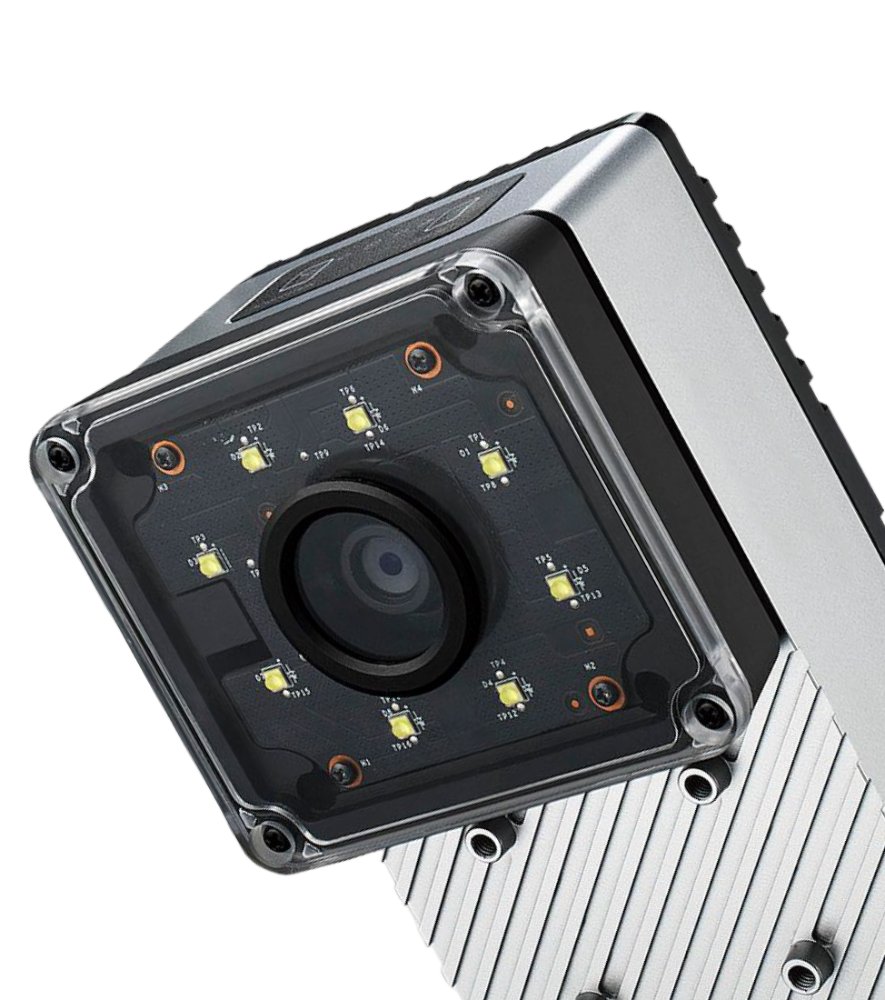
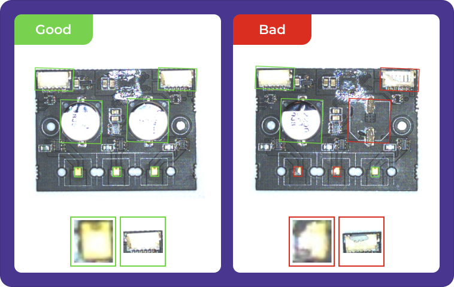

<table>
  <tr>
    <td align="center">
      
    </td>
    <td align="center">
      
    </td>
  </tr>
</table>

# Overview.ai Vision System – OV20i & OV80i

**Edge-native AI vision inspection for industrial manufacturing** – Smart cameras powered by NVIDIA Jetson delivering real-time defect detection, classification, and measurement directly on the production line.

---

## 1. Product Overview

Overview.ai's **OV20i** and **OV80i** are ruggedized smart camera systems that bring advanced computer vision directly to industrial environments. Designed for quality engineers, automation specialists, and manufacturing teams, these devices eliminate the complexity of traditional vision systems while providing enterprise-grade AI capabilities.

**Key Value Propositions:**

- **Zero Cloud Dependency** – All AI processing happens locally for maximum reliability
- **Industrial-Grade Connectivity** – Native EtherNet/IP and PROFINET integration
- **Self-Training AI** – Continuous learning from production data
- **Plug-and-Play Setup** – Recipe-based configuration, no programming required

<table>
  <tr>
    <td align="center">
      
    </td>
    <td align="center">
      
    </td>
    <td align="center">
      
    </td>
  </tr>
</table>

---

## 2. Core AI & Vision Technologies

### NVIDIA Acceleration Stack

- **CUDA Processing**: GPU-accelerated parallel image processing
- **TensorRT Optimization**: Automatic neural network optimization for maximum inference speed
- **Jetson Platform**: Purpose-built edge AI hardware (Xavier NX on OV20i, Orin NX on OV80i)

### Advanced Vision Algorithms

- **Deep Learning Classification**: Multi-class defect detection and product sorting
- **Semantic Segmentation**: Pixel-level analysis for complex shape and region detection
- **OCR/OCV Engine**: Robust optical character recognition and verification

### Real-Time Performance

- **Sub-50ms Inference**: Hardware-accelerated processing with deterministic timing
- **Parallel Processing**: Multi-threaded execution for complex inspection sequences
- **Adaptive Learning**: Self-improving models based on production feedback

<table>
  <tr>
    <td align="center">
      
    </td>
    <td align="center">
      
    </td>
    <td align="center">
      
    </td>
  </tr>
</table>

---

## 3. Hardware Platforms

### OV20i (Compact Inspection Camera)

- **Compute**: NVIDIA Jetson Xavier NX with AI acceleration
- **Resolution**: 1408 × 1080 optimized for close-proximity inspection
- **Lighting**: Integrated LED array with programmable intensity patterns
- **Connectivity**: M12 industrial connectors, digital I/O, USB configuration

### OV80i (High-Resolution Inspection Camera)

- **Compute**: NVIDIA Jetson Orin NX for maximum processing power
- **Resolution**: 3840 × 2160 4K imaging for detailed analysis
- **Optics**: C-mount lens compatibility with external lighting support
- **I/O**: Comprehensive digital inputs/outputs plus fieldbus integration

> Both platforms feature fanless operation, extended temperature ranges, and IP-rated enclosures.

---

## 4. Industrial Integration & Connectivity

### PLC Communication

- **EtherNet/IP**: Allen-Bradley, Omron, etc. with automatic EDS file generation
- **PROFINET**: Siemens, Phoenix Contact, etc. with GSDML file support
- **Digital I/O**: Hardware triggers, pass/fail outputs, status indicators

### Enterprise Connectivity

- **HTTPS Web Interface**: Secure remote access and configuration
- **FTP Services**: Automated data export and system integration
- **Node-RED Automation**: Visual programming for custom inspection workflows
- **RESTful APIs**: Standard integration with MES/ERP systems

---

## 5. Software Capabilities

### User Interface

- **Recipe Builder**: Intuitive setup for inspection parameters and ROI configuration
- **Live Monitoring**: Real-time visualization
- **Data Library**: Searchable archive with labeling tools for continuous learning
- **Analytics Dashboard**: Production metrics, quality KPIs, and trend analysis

### Applications & Use Cases

- **Quality Control**: Surface defects, dimensional verification, assembly checking
- **Text Inspection**: OCR/OCV for labels, codes, and print quality verification
- **Process Monitoring**: Real-time line monitoring with statistical process control
- **Traceability**: Automated documentation, batch tracking, compliance reporting

---

## 6. Network Access & Setup

### System Management

- **Activation**: Cloud-based licensing with offline capability
- **Updates**: Secure `.ovupdate` packages with over-the-air deployment
- **Security**: Role-based access, HTTPS encryption, audit logging

---

## 7. System Visuals & Examples

<table>
  <tr>
    <td align="center">
      
    </td>
    <td align="center">
      
    </td>
  </tr>
  <tr>
    <td align="center">
      
    </td>
    <td align="center">
      
    </td>
  </tr>
  <tr>
    <td align="center">
      
    </td>
  </tr>
</table>

---

## 8. Demo Application Setup

This repository includes a comprehensive demonstration environment that showcases the Overview.ai Vision System capabilities using simulated components and sample data.

### Quick Start

```bash

# Start the demo stack
docker-compose -f docker-compose.demo.yml up -d

# Access the demo interface
open http://localhost:8080
```

### Demo Components

The demo includes simulated versions of all core system components:

- **Vision Processing Engine**: Sample classification and segmentation models with CUDA/TensorRT acceleration
- **Web Dashboard**: Interactive recipe builder and live monitoring interface
- **PLC Simulator**: Virtual EtherNet/IP and PROFINET devices for integration testing
- **Node-RED**: Visual programming environment with industrial communication nodes
- **Sample Data**: Pre-loaded inspection scenarios and training datasets

### Demo Scenarios

1. **Defect Detection**: Surface defect classification on sample parts
2. **OCR/OCV**: Text verification on product labels
3. **Dimensional Analysis**: Measurement verification workflows
4. **PLC Integration**: Real-time data exchange demonstration

---

## 9. Support & Next Steps

### Getting Started

1. **Demo Request**: Schedule live demonstration with your parts
2. **Proof of Concept**: Evaluate system performance in your environment

---

> **Ready to transform your quality control process?**  
> visit [www.overview.ai](https://www.overview.ai) to learn more about implementing AI-powered vision inspection in your facility.
